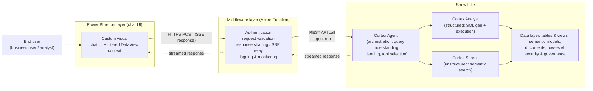

# Architecture

Snowflake Cortex Chat for Power BI: a chat visual inside a Power BI report, a
middleware layer in Azure, and a Snowflake Cortex Agent that orchestrates
Cortex Analyst (structured data) and Cortex Search (unstructured data).

The agent chooses the right tool (Analyst vs Search) per question; the visual's
job is to deliver the question **plus what the user is currently looking at**
(bound fields + active filters, serialized by `visual/src/contextBuilder.ts`)
and to render the streamed answer — text, tool activity, generated SQL, charts
(Vega-Lite), and tables.

## Layer responsibilities

| Layer | Code | Responsibilities |
|---|---|---|
| Chat UI | `visual/src/visual.ts` | Chat transcript, streaming render, charts/tables, Stop/retry, settings |
| Context | `visual/src/contextBuilder.ts` | DataView → `REPORT CONTEXT` prompt block (fields, ≤200 rows CSV, filters) |
| Transport | `visual/src/agentClient.ts` | SSE client: chunk-safe parsing, event extraction, retry with backoff |
| Middleware | `proxy/src/functions/agentProxy.ts` | Auth, CORS, request validation, credential custody, SSE passthrough |
| Agent | `snowflake/*.sql` | Agent definition, service role/user, PAT, grants (SELECT-only) |

## Middleware: two deployment models

### Model A — bundled proxy (works today)

The repo ships its own Azure Function (`proxy/`). It holds the Snowflake PAT in
app settings, authenticates callers with a shared key (`x-proxy-key`,
constant-time compare, fails closed), and relays the `agent:run` SSE stream
untouched. `deploy.sh` provisions it end to end. This is the pilot path and the
fallback if platform integration stalls.

### Model B — MSU internal AI platform middleware (target)

MSU already operates an internal AI agent platform ("MSAI") whose middleware is
an Azure Function layer with real SSO. The plan is to **lean into that**: the
visual calls the platform middleware instead of (or via) the bundled proxy, and
the platform handles identity and Snowflake credential exchange.

What we know about that platform — **VERIFIED 2026-07-17 from screenshots of
its backend source** (`the platform backend source`), which decode the
earlier second-hand notes:

- **Per-user delegated auth via OAuth On-Behalf-Of.** The backend is a
  confidential client (app id + secret from Key Vault) that takes the caller's
  Entra bearer token and exchanges it with MSAL `acquire_token_on_behalf_of`
  for a Snowflake-audience access token (scope of the form
  `https://<snowflake-app-guid>/session:scope-any`). That means **Snowflake
  External OAuth with Entra is already configured at the account level** —
  the end-state we planned as "Phase 3" is operational there today. No service
  principal, no shared PAT: every Cortex call runs *as the end user*.
- **Role selection is a request header.** The backend sends
  `X-Snowflake-Role: <sg_group>` — the role comes from the user's AD
  security-group membership (hence the `SG_*` role naming), and
  `session:scope-any` lets the token assume any role the user actually holds.
  Snowflake enforces membership; the client merely selects.
- **Server-side threads.** The backend has `create_thread(self, application)` —
  it uses the Cortex Threads API, keyed by an *application* parameter,
  implying a platform-level registry of applications/agents. (Their backend
  may use the generic `agent:run` form where the agent config rides the
  request rather than a named agent object — confirm.)
- **Streaming-ready headers.** Requests are sent with
  `Accept: application/json, text/event-stream` — the SSE path exists at
  least toward Snowflake; whether the platform relays it to callers is still
  open (question 1).
- It enforces **CORS** at its gateway; as field-tested, the endpoint currently
  returns no CORS headers to preflights (see question 3 for the fix it needs).

### Open questions for the platform team

Get written answers before wiring Model B:

1. **Endpoint contract** — URL, method, request schema. Does it accept the
   Cortex `agent:run` message format or its own? Does it **stream** (SSE /
   chunked), or buffer? Streaming is load-bearing for UX; if it buffers, we
   front it with our relay (Model A function calling the platform) or accept
   degraded UX.
2. **Token acquisition from inside a Power BI visual — now THE integration
   question.** The backend's OBO flow needs the *user's* Entra access token
   (audience = the platform's backend app registration) as input, and a
   sandboxed visual cannot silently mint one (see Authentication below). Ask
   the platform team: can they host a small sign-in page that issues a token
   (or short-lived pairing code) the user can hand to the visual — the
   `launchUrl` flow in the auth ladder? Everything downstream of that token
   (Snowflake OAuth, role, RLS) they already handle.
2b. **Agent/application registry** — `create_thread(self, application)`
   implies agents are selected by an application parameter. What are the valid
   values, who registers new ones, and is the desired `X-Snowflake-Role`
   selectable per request by the caller (bounded by the user's AD groups)?
   This determines how the visual's "agent" setting maps onto their API.
3. **CORS** — the gateway must (a) answer `OPTIONS` preflights on the endpoint,
   (b) return `Access-Control-Allow-Origin: *`, and (c) allow the
   `authorization` + `content-type` request headers. Allowlisting
   `https://app.powerbi.com` is NOT sufficient and NOT what will arrive: a
   sandboxed visual's Origin is the literal string `null` (see "CORS and
   origins" below — field-confirmed against this very gateway, which currently
   returns no CORS headers at all). Auth must ride the `Authorization` header,
   never cookies: cookie-credentialed CORS is both blocked/unsafe here and
   impossible from the visual sandbox anyway.
4. **Session/conversation state** — does the platform track conversations
   server-side (thread ids) or is each call stateless? (Our current design
   resends capped history each call; see Session management.)
5. **Snowflake reachability** — which Snowflake host does the middleware reach,
   and is it PrivateLink-only? (See Networking.)
6. **Rate limits / quotas / logging** — anything that shapes retry behavior or
   payload size.

## Authentication

### The constraint that shapes everything

Power BI's official visual SSO API (`acquireAADToken` /
`AADAuthentication` privilege) is **restricted to AppSource-certified-store
visuals** — organizational (privately distributed) visuals cannot call it (still
true as of mid-2026). So the visual cannot silently obtain an Entra token for
the signed-in report user. Every auth design must work around that.

### Ladder (weakest → strongest)

1. **Shared key (today).** One key per deployment, entered once per user,
   stored via the visual storage API (browser localStorage; never in the .pbix).
   Fine for a pilot; everyone shares the service role's access.
2. **Bearer token (built).** The proxy has a pluggable `AUTH_MODE` app
   setting: `shared-key` (default) or `entra`, which validates
   `Authorization: Bearer <JWT>` offline — signature via the tenant JWKS,
   issuer (v2 + legacy v1 forms), exact `ENTRA_AUDIENCE`, expiry; fail-closed
   if `ENTRA_TENANT_ID`/`ENTRA_AUDIENCE` are unset, and unknown modes reject
   everything (`proxy/src/functions/auth.ts`). The visual can send a bearer
   token instead of the shared key. How the user *gets* the token is step 3.
3. **Interactive sign-in via `launchUrl` (design).** The visual opens the
   middleware's login page in a new tab (`host.launchUrl()` — allowed for
   organizational visuals). The user completes SSO there; the page displays a
   short-lived **pairing code**; the user pastes it into the visual once; the
   visual exchanges it for a session token (stored like the key today,
   refreshed silently until expiry). This gives real per-user identity with
   zero AppSource dependency. Build it against the platform middleware once
   question 2 above is answered.
4. **Per-user Snowflake OAuth (target, "Phase 3").** With per-user tokens
   flowing (via 3, or via AppSource publication unlocking `acquireAADToken`),
   the middleware exchanges Entra tokens for Snowflake OAuth tokens (External
   OAuth integration) and Snowflake RBAC / row-level security applies **per
   person** instead of per service user. **Verified 2026-07-17: the platform
   middleware already does exactly this** (MSAL On-Behalf-Of →
   `session:scope-any` Snowflake token + `X-Snowflake-Role` from the user's AD
   group). Integrating with it collapses Phase 3 into "solve step 3's token
   handoff" — the Snowflake side is done.

## Session management

Power BI visuals are **session-independent**: the host may unload and recreate
a visual on page switches, refreshes, or edits, and nothing identifies "the
same user's conversation" across instances. Design:

- **Client-owned conversation state.** The visual keeps the transcript and a
  generated conversation id, persisted via the visual storage API
  (`storageV2`), so a page switch or reload restores the conversation instead
  of losing it. Storage is per-user, per-browser — exactly the scope a chat
  should have.
- **Stateless middleware calls.** Each request carries the capped history
  (last 10 turns, older turns stripped of their context blocks) plus one fresh
  `REPORT CONTEXT` snapshot. The middleware needs no session store; any
  instance can serve any request. A conversation id header
  (`x-conversation-id`) rides along for log correlation — the proxy sanitizes
  it (`[A-Za-z0-9_-]`, ≤64 chars), uses it in log lines only, and never
  forwards it to Snowflake.
- **Why not server-side threads:** Snowflake's Threads API persists every
  message *as sent*, so each turn's context block would accumulate server-side
  and the agent would see stale report snapshots beside the current one.
  Resending capped history is cheap and keeps exactly one context snapshot in
  view. Revisit only with a context-delivery redesign.

## CORS and origins

**A custom visual's Origin is the literal string `null` — verified 2026-07-16**
(4-lens research pass: Microsoft docs, field reports, Fetch/HTML specs,
adversarial counter-search). The chain: Power BI hosts visuals in a sandboxed
iframe *without* `allow-same-origin` → the visual gets an **opaque origin** →
CORS-mode fetches serialize `Origin: null`. Confidence ratings:

- *Certain*: `Origin` is a forbidden header — no code in the visual can set or
  change it; and in the **Service**, visual fetches carry `Origin: null`
  (field-confirmed repeatedly 2021–2025, incl. Microsoft support statements).
- *High*: **Desktop** sends `null` or omits the header; no privilege,
  certification tier, or embedding mode yields a real origin (zero counter-
  examples since the 2016 sandbox change).
- *Caveat*: this is undocumented Microsoft implementation behavior, not a
  contract — it changed once (March 2016) and could change again.

Consequences, baked into the bundled proxy:

- `ALLOWED_ORIGINS` defaults to `*`: there is **no real domain to allowlist**,
  and `*` is the only value that works under every open ambiguity (null,
  absent, or a hypothetical future real origin). Wildcard is safe *only*
  because auth rides explicit fail-closed headers and the proxy never sends
  `Access-Control-Allow-Credentials`. If Microsoft ever gives visuals a real
  origin, tightening is a one-line setting change (the allowlist branch is
  still there).
- **Never echo `Access-Control-Allow-Origin: null`** as a "tighter" option —
  every sandboxed frame and `file://` page on earth shares the `null` origin,
  and pairing it with credentials is a documented attack surface. It's
  wildcard-equivalent with extra risk.
- **Cookie/session auth cannot work from a visual** — the sandbox has no
  cookie access in the first place. Any auth design for this endpoint must
  carry the credential in a request header.

## Streaming and the WebAccess privilege

The visual declares the hosts it may call in `capabilities.json` →
`privileges[WebAccess].parameters`. Rules that bite:

- The list is **baked into the .pbiviz at build time**. Changing the middleware
  host means rebuild → re-import → (for org-wide installs) re-upload to the
  Organizational visuals store — i.e., **an approval cycle**. When the platform
  middleware URL is known, add it *alongside* the bundled proxy host in one
  build to avoid a second cycle.
- Because of WebAccess, the visual can never be a *certified* visual. That's
  intentional; distribution is via Organizational visuals (tenant admin
  upload), which also requires the tenant setting "Visuals created by the
  Power BI SDK" to be allowed.
- Streaming itself is plain `fetch` + ReadableStream over HTTPS — no extra
  privilege beyond WebAccess, but the middleware's hosting plan must not
  buffer (Flex Consumption streams; some plans buffer, which degrades to
  all-at-once answers).

## Networking (read before deploying)

The pilot Snowflake account may be **PrivateLink-only**
(`msu-prod.east-us-2.privatelink.snowflakecomputing.com`-style host, resolvable
only inside the corporate network). A default public Azure Function **cannot
reach such a host** — calls fail as DNS/connect timeouts, which look like auth
bugs but aren't. Resolve first, with the cloud team:

1. Function App with **VNet integration** inside the corporate Azure estate
   (the platform middleware presumably already sits there — one more argument
   for Model B), or
2. the account's **public endpoint** with Snowflake network policies pinned to
   the Function's egress IPs, or
3. host the relay somewhere that can reach PrivateLink.

`deploy.sh` uses `https://msu-prod.snowflakecomputing.com` as the account URL —
verify which host actually resolves from where the Function runs (the SETUP.md
Part 1 curl, run from that network, settles it).

## Go-live sequence

Each stage proves one seam before the next builds on it:

| Stage | Prove | How |
|---|---|---|
| 0 | Networking answered | Cloud team confirms one of the three options above |
| 1 | Agent reachable + PAT valid | SETUP.md Part 1 curl streams `response.text.delta` events |
| 2 | Middleware relays | Deploy proxy (`deploy.sh`), curl it with `x-proxy-key`, see the same stream |
| 3 | Visual → middleware in Desktop | Import .pbiviz, configure URL + key, ask a question |
| 4 | Same in the Service | Publish; confirms CORS + tenant settings |
| 5 | Structured test pass | Streaming, multi-turn memory, context correctness, tools/charts/tables, failure modes, security spot-checks (SETUP.md Part 4 + tests) |
| 6 | Org rollout | Organizational visuals upload; key distribution; monitoring |

Model B integration (platform middleware + SSO) can proceed in parallel from
Stage 2 onward: answer the open questions, add the middleware host to
WebAccess, switch the visual's endpoint + auth mode, re-run Stages 3–5.

## Security posture (invariants — do not trade away silently)

- Snowflake credentials live **only** in Function app settings (→ Key Vault
  reference in production). Never in the visual, the .pbix, or format-pane
  settings.
- The service role is **SELECT-only**: prompt injection via report data or
  documents is mitigated (framing + read-only blast radius), not solved.
- All agent output reaches the DOM as **text, never markup** (`textContent`;
  the rich-text renderer builds DOM nodes, no `innerHTML`). Vega specs render
  through vega-interpreter (`ast: true`), not compiled JavaScript.
- Snowflake error bodies are logged server-side, never relayed to the browser.
